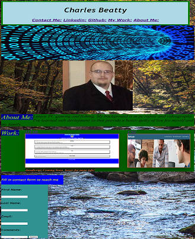

# Portfolio

## Table of Contents
[Description](#description) 
[Useage](#usage) 
[Screeshot](#screeshot) 
[Access](#access) 
[Credits](#credits) 
[Roadmap](#roadmap) 
[License](#license)

## Description
I want an employer to view my portfolio. As a potential employee the company can view work samples
so that they can assess whether I am  a good candidate for an open position. This portfolio has work examples, information about me, and multipules ways of contacting me.

## Usage
Give a presentation of myself for employers and clients.
Tested for iphone SE, ipad air, pc desktop.

## Screeshot

## Access

[Github](https://www.github.com/beattycharles)
[Portfolio](https://beattycharles.github.io/Portfolio/)

## Credits
Special Thanks to: https://github.com/BogartDME https://github.com/EvolanGIT https://github.com/difurung.
Thank you to dnr.maryland.gov for background image and oecd-nea.org for hero image.

## Roadmap
Future updates are to include examples of Javascript work, more optimations and styling.

## License
Copyright (c) 2022 Charles Beatty

Permission is hereby granted, free of charge, to any person obtaining a copy of this software and associated documentation files (the "Software"), to deal in the Software without restriction, including without limitation the rights to use, copy, modify, merge, publish, distribute, sublicense, and/or sell copies of the Software, and to permit persons to whom the Software is furnished to do so, subject to the following conditions:

The above copyright notice and this permission notice shall be included in all copies or substantial portions of the Software.

THE SOFTWARE IS PROVIDED "AS IS", WITHOUT WARRANTY OF ANY KIND, EXPRESS OR IMPLIED, INCLUDING BUT NOT LIMITED TO THE WARRANTIES OF MERCHANTABILITY, FITNESS FOR A PARTICULAR PURPOSE AND NONINFRINGEMENT. IN NO EVENT SHALL THE AUTHORS OR COPYRIGHT HOLDERS BE LIABLE FOR ANY CLAIM, DAMAGES OR OTHER LIABILITY, WHETHER IN AN ACTION OF CONTRACT, TORT OR OTHERWISE, ARISING FROM, OUT OF OR IN CONNECTION WITH THE SOFTWARE OR THE USE OR OTHER DEALINGS IN THE SOFTWARE.